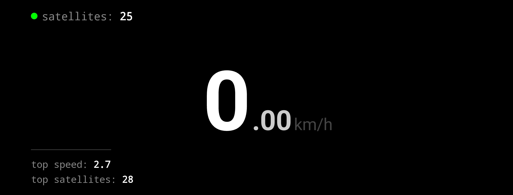
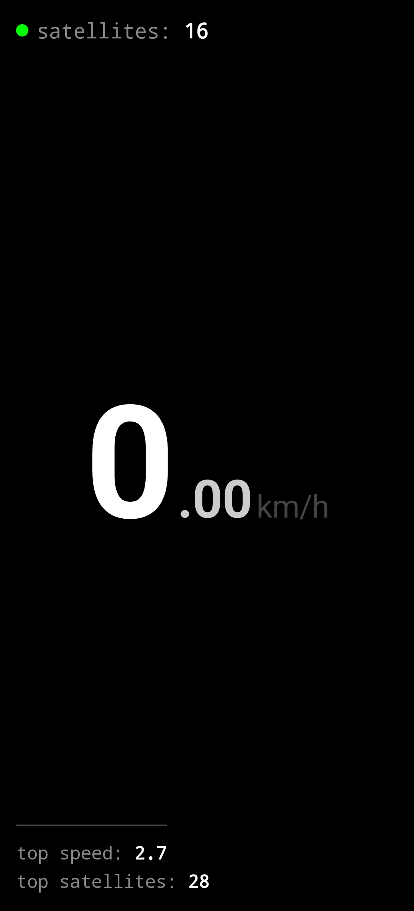

# GPS Speedometer

A minimalist, privacy-focused Android speedometer built with Kotlin and Jetpack Compose. It provides real-time GPS data with a high-contrast HUD interface designed for readability.

## Motivation

I got tired of dirty ad filled, user tracking, etc speedometer apps, so I made this simple one. Download the APK from Releases or build from source.

## Features

* **Real-time Speed:** Centered display in km/h with dynamic font sizing to fit any screen width.
* **Satellite Status:** Real-time GNSS satellite count with a color-coded status indicator (Red/Green).
* **Session Statistics:**
    * **Top Speed:** Tracks the maximum speed reached in the current session.
    * **Top Satellites:** Tracks the maximum number of satellites connected.
* **Smart Logic:**
    * **5-Second Warmup:** Max speed tracking only begins 5 seconds after GPS lock to prevent initialization spikes.
    * **Tunnel Detection:** Automatically resets speed to `0` if GPS data stops for >2 seconds.
    * **Noise Filter:** Ignores "drift" speeds (< 1.5 km/h) and low-accuracy fixes (> 50m radius).
* **Privacy & Cleanliness:**
    * **No Ads:** Completely free and clean interface.
    * **No Tracking:** No analytics, no data collection, no internet permission required.
    * **No Background Drain:** App completely stops GPS usage when minimized to save battery.

## Session Behavior

> **Note:** This app is designed as an active dashboard.

* **Active Only:** Speed and stats are tracked only while the screen is on and the app is visible.
* **Auto-Reset:** Minimizing the app, turning off the screen, or switching apps **immediately wipes** all session data (current speed, max speed, satellite counts).
* **Battery Safe:** The app aggressively disconnects from the GPS hardware the moment it loses focus.

## Preview

<p align="center">
  
</p>
<p align="center">
  
</p>

## Tech Stack

* **Language:** Kotlin
* **UI Framework:** Jetpack Compose (Material3)
* **API:** Android `LocationManager` & `GnssStatus` (Raw GPS access)
* **Architecture:** Lifecycle-aware components with Coroutines for watchdog timers.
* **Min SDK:** 24
* **Target SDK:** 34

## Build & Install (CLI)

1.  **Clone**
    ```bash
    git clone <repo_url>
    cd gps-speedometer
    ```

2.  **Build & Install (Using Makefile)**
    ```bash
    make install
    ```
    *Or manually:* `./gradlew assembleRelease && adb install -r app/build/outputs/apk/release/app-release.apk`

## License

MIT