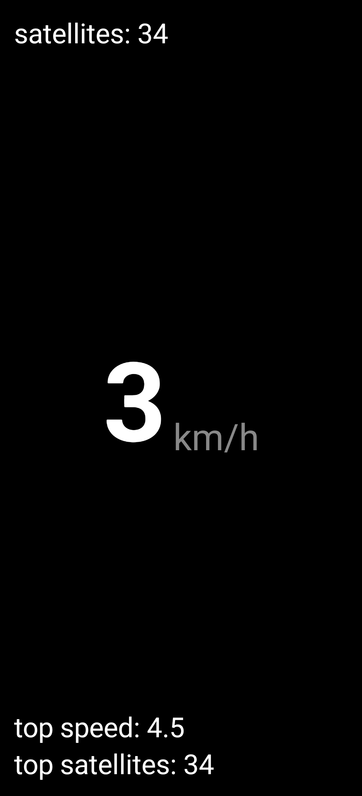

# GPS Speedometer

A minimalist Android application built with Kotlin and Jetpack Compose. Displays real-time GPS speed, satellite connection status, and conditional max speed tracking.

## Motivation

I got tired of dirty ad filled, user tracking, etc speedometer apps, so I made this simple one. Download the APK from Releases or build from source.


## Preview

<p align="center">
  
</p>

## Features

* **Real-time Speed:** Centered display in km/h (Large font).
* **Satellite Status:** GNSS satellite count (used in fix) shown in top-left.
* **Max Speed Tracking:** Shown in bottom-left.
    * *Logic:* Updates only if `Uptime > 5 seconds` AND `Satellites >= 3`.
* **Top Satellites:** Tracks maximum satellite count in session.
* **UI:** High contrast (White text on Black background), muted units.

## Tech Stack

* **Language:** Kotlin
* **UI Framework:** Jetpack Compose (Material3)
* **API:** Android `LocationManager` & `GnssStatus` (Raw GPS access)
* **Min SDK:** 24 (Required for `GnssStatus`)
* **Target SDK:** 34

## Build & Install (CLI)

1.  **Clone**
    ```bash
    git clone <repo_url>
    cd gps-speedometer
    ```

2.  **Build & Install (Using Makefile)**
    ```bash
    make install
    ```
    *Or manually:* `./gradlew assembleRelease && adb install ...`

## Logic Reference

The core logic for the max speed filter is located in `MainActivity.kt`:

```kotlin
val timeElapsed = SystemClock.elapsedRealtime() - appStartTime
if (timeElapsed > 5000 && satelliteCount >= 3) {
    if (speedKmh > maxSpeedKmh) {
        maxSpeedKmh = speedKmh
    }
}